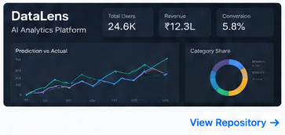
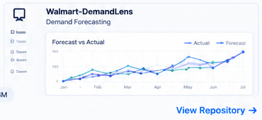
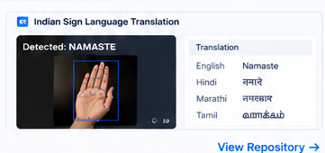
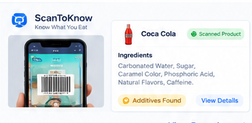

<h1 align="left">Hi, I’m Kaustubh Suryawanshi 👋</h1>

<strong>Data Science</strong> &nbsp;•&nbsp; <strong>Machine Learning</strong> &nbsp;•&nbsp; <strong>AI</strong>

I build data-driven solutions that solve real-world problems using Python, SQL and AI.

<a href="https://www.linkedin.com/in/kaustubh-suryawanshi18/">LinkedIn</a> &nbsp; · &nbsp; <a href="https://kauatubh-suryawanshi.github.io/">Portfolio</a> &nbsp; · &nbsp; <a href="mailto:kaustubh18.work@gmail.com">Email</a> &nbsp; · &nbsp; <a href="https://github.com/Kauatubh-Suryawanshi">GitHub</a>

> *“Turning data, models and ideas into useful solutions.”*  
> — *Kaustubh S.*

---

## 📊 Tech Stack

<table>
<tr>
<td align="center" width="14%">  <b>Python</b> &nbsp;</td>
<td align="center" width="14%">  <b>SQL</b> &nbsp;</td>
<td align="center" width="14%">  <b>Pandas</b> &nbsp;</td>
<td align="center" width="14%">  <b>Scikit-learn</b> &nbsp;</td>
<td align="center" width="14%">  <b>Docker</b> &nbsp;</td>
<td align="center" width="14%">  <b>Git</b> &nbsp;</td>
<td align="center" width="14%">  <b>GitHub</b> &nbsp;</td>
</tr>
</table>

---

## 📁 Featured Projects

<table>
<tr>
<td width="46%" valign="middle" align="center">

</td>
<td width="54%" valign="middle">

### 01 &nbsp; **[DataLens](https://github.com/Kauatubh-Suryawanshi/DataLens)**
**AI Analytics Platform**

Natural-language analytics platform with explainable machine learning and interactive insights.

`Python` &nbsp; `FastAPI` &nbsp; `XGBoost` &nbsp; `Docker`

**[◉ View Repository →](https://github.com/Kauatubh-Suryawanshi/DataLens)** &nbsp;&nbsp; **[↗ Live Demo](https://da-b8fcff1a967d48e3937817ca912c6165.ecs.ap-south-1.on.aws/)**

</td>
</tr>
</table>

<table>
<tr>
<td width="46%" valign="middle" align="center">

</td>
<td width="54%" valign="middle">

### 02 &nbsp; **[Walmart-DemandLens](https://github.com/Kauatubh-Suryawanshi/Walmart-DemandLens)**
**Multi-Model Demand Forecasting**

Time-series demand forecasting system using SARIMA, Prophet and LightGBM with feature engineering and model comparison.

`Python` &nbsp; `SARIMA` &nbsp; `Prophet` &nbsp; `LightGBM` &nbsp; `Streamlit`

**[◉ View Repository →](https://github.com/Kauatubh-Suryawanshi/Walmart-DemandLens)** &nbsp;&nbsp; **[↗ Live Demo](https://wa-34f24463db7f4835b59319c610bee00a.ecs.ap-south-1.on.aws/)**

</td>
</tr>
</table>

<table>
<tr>
<td width="46%" valign="middle" align="center">

</td>
<td width="54%" valign="middle">

### 03 &nbsp; **[Indian Sign Language Translation](https://github.com/Kauatubh-Suryawanshi/Indian-Sign-Language-To-Regional-Language-Translation-System)**
**Computer Vision + Multilingual AI**

Real-time sign detection and multilingual translation using YOLO, OpenCV, PyTorch and Gemini API.

`Python` &nbsp; `YOLO` &nbsp; `OpenCV` &nbsp; `PyTorch` &nbsp; `Gemini`

**[◉ View Repository →](https://github.com/Kauatubh-Suryawanshi/Indian-Sign-Language-To-Regional-Language-Translation-System)**

</td>
</tr>
</table>

<table>
<tr>
<td width="46%" valign="middle" align="center">

</td>
<td width="54%" valign="middle">

### 04 &nbsp; **[ScanToKnow](https://github.com/Kauatubh-Suryawanshi/ScanToKnow)**
**Food Ingredients Analyzer**

Food intelligence platform for scanning packaged products and retrieving ingredient information through OpenFoodFacts.

`Django` &nbsp; `MongoDB` &nbsp; `Flutter` &nbsp; `OpenFoodFacts`

**[◉ View Repository →](https://github.com/Kauatubh-Suryawanshi/ScanToKnow)**

</td>
</tr>
</table>

---

<table>
<tr>
<td width="50%" valign="top">

### 🏆 Proof of Work

🥈 **2nd Place — XZIBIT 2026**  
National Project Competition

🔬 **Finalist — Aavishkar 2025**  
University Research Convention

📜 **Patent Pending — SCAN-TO-KNOW**  
AI-powered Food Ingredients Analyzer

</td>
<td width="50%" valign="top">

### 🎯 Currently Building

☑ Production-ready ML systems  
☑ Advanced time-series forecasting  
☑ AI-powered analytics tools  
☑ Model deployment & APIs  
☑ Open-source contributions

</td>
</tr>
</table>

---

## 📈 GitHub Activity

Live contribution activity from my GitHub profile

---

*Let’s connect and build something meaningful.*

**[LinkedIn](https://www.linkedin.com/in/kaustubh-suryawanshi18/)** &nbsp; · &nbsp; **[GitHub](https://github.com/Kauatubh-Suryawanshi)** &nbsp; · &nbsp; **[Portfolio](https://kauatubh-suryawanshi.github.io/)** &nbsp; · &nbsp; **[Email](mailto:kaustubh18.work@gmail.com)**

